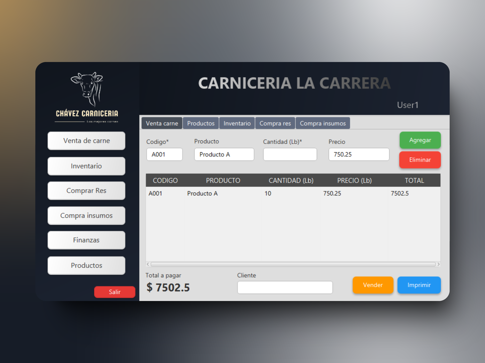

# Inventario Carnicería 🥩💻



## Descripción

Esta es una aplicación de escritorio desarrollada en JavaFX para gestionar el inventario de una carnicería. La aplicación permite llevar un control detallado de diversos aspectos relacionados con el funcionamiento de la carnicería, incluyendo:

- Registro de la compra de animales para beneficio.
- Compra de utensilios para la carnicería.
- Registro de tipos de carnes con su respectivo valor.
- Generación de documentos PDF con el inventario de cada apartado.

## Características ✨

- **Gestión de Animales**: Registro y control de la compra de animales para beneficio.
- **Utensilios de Carnicería**: Registro de la compra de utensilios necesarios para la operación.
- **Tipos de Carnes**: Registro y actualización de tipos de carnes disponibles con precios asociados.
- **Generación de PDF**: Creación de documentos PDF con el inventario detallado para cada categoría.

## Tecnologías Utilizadas ⚙

- **Java**: Versión 18.0.1.1
- **Maven**: Versión 3.9.9
- **JavaFX**: Versión 13
- **MySQL Connector**: Versión 8.0.32
- **Kotlin**: Versión 1.6.0
- **Log4j**: Versión 1.2.12
- **Commons IO**: Versión 2.6

## Instalación 💻

Para ejecutar esta aplicación, sigue estos pasos:

1. Clona el repositorio:

   ```bash
   git clone https://github.com/DavidSepulvedaCh/ButcherShop.git
   ```

2. Navega al directorio del proyecto:

   ```bash
   cd ButcherShop
   ```

3. Compila y ejecuta la aplicación en tu IDE:

   ```bash
   run App.java
   ```

   Asegúrate de tener Maven y JavaFX correctamente instalados y configurados en tu entorno.

## Contribuciones 🤝

Las contribuciones son bienvenidas. Si tienes sugerencias o encuentras algún problema, por favor, abre un issue o envía una solicitud de extracción (pull request).

## Licencia ⚖

Este proyecto está bajo la Licencia MIT - ver el archivo [LICENSE](./LICENSE) para más detalles.

## Contacto 📧

Para cualquier pregunta o comentario, puedes contactarme en [sdavidleonardo01@gmail.com](mailto:sdavidleonardo01@gmail.com).
